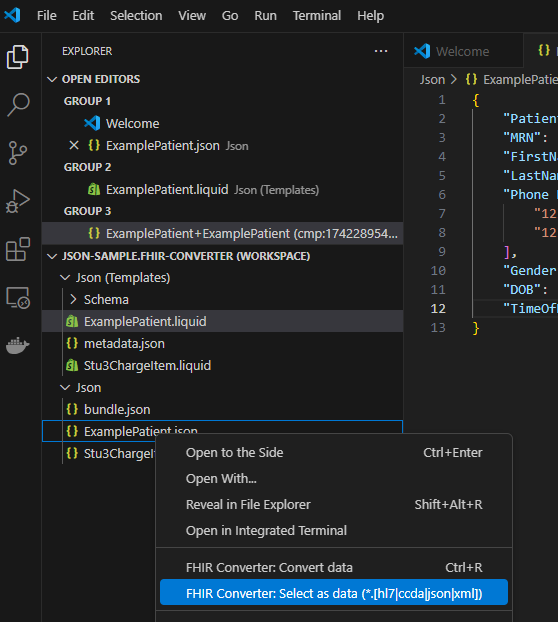
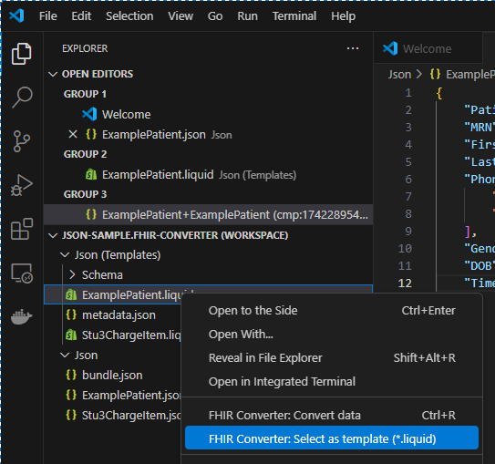
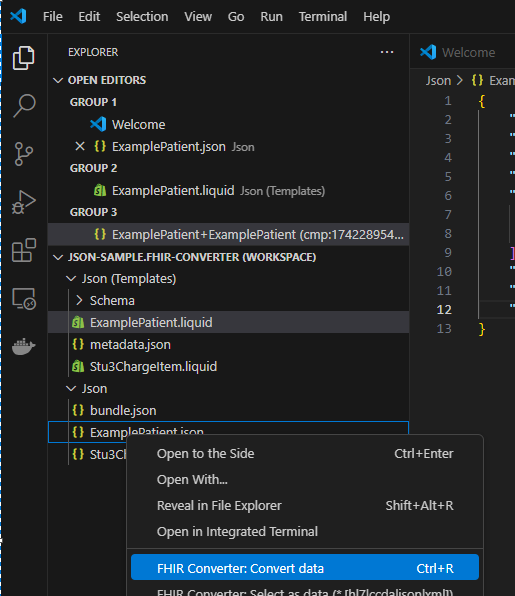
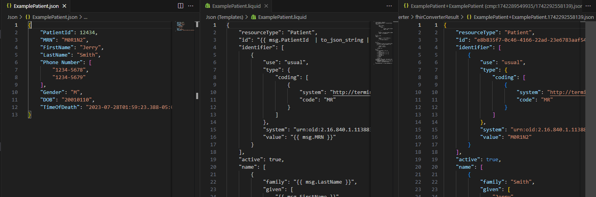

# Getting Started

## Prerequisites
Before setting up the project, ensure you have the following installed:
- [Git for Windows](https://gitforwindows.org/)
- [Node.js and npm](https://nodejs.org/) (Latest LTS recommended)
- A Linux distribution connected to the **WSL** extension
- The latest version of **TypeScript** (`npm install -g typescript`)

## First-time Setup

1. Clone the required repositories:
   ```sh
   git clone https://servicewell.visualstudio.com/swts/_git/fhir-liquid-converter
   git clone https://servicewell.visualstudio.com/swts/_git/vscode-fhir-liquid-converter
   ```
2. Use the following suggested folder structure:
   ```
   swts/
   ├── fhir-liquid-converter/
   ├── vscode-fhir-liquid-converter/
   ```

3. Open **Command Prompt (cmd)** and navigate to:
   ```sh
   cd swts\vscode-fhir-liquid-converter\FHIR-Converter
   ```
4. Install dependencies:
   ```sh
   npm install
   ```

## Troubleshooting

### Issues with Git Bash vs. WSL Bash
If you encounter issues related to **Git Bash vs. WSL Bash**, modify `package.json`:
- Change `postinstall` and `download-templates` to `postinstall_with_git_bash` and `download-templates_with_git_bash`.


## Configuration
Build the c# project:
```plaintext
swts\fhir-liquid-converter\src\Microsoft.Health.Fhir.Liquid.Converter.Tool
```
and set the correct path to **FHIR Engine output folder** in:
```plaintext
...\FHIR-Converter\client\src\core\common\constants\engine.ts
```
Update the following line to match the output folder of the **FHIR Converter Engine** you want to debug with:
```typescript
export const DefaultEngineFolder = "C:\Users\TheoKinell\source\repos\swts\fhir-liquid-converter\src\Microsoft.Health.Fhir.Liquid.Converter.Tool\bin\Debug\net8.0";
```

## Start Debugging

### 1. Create a Workspace
To begin debugging, follow these steps to create a workspace:

1. **Open the Command Palette**  
   In VS Code, navigate to:  
   **View → Command Palette** (`Ctrl + Shift + P`)

2. **Select the FHIR-Converter workspace**  
   - Search for and select:  
     **FHIR-Converter: Create Workspace**

3. **Choose Data and Template Folders**  
   - When prompted, select:
     - **Template folder** → Contains FHIR transformation templates.
     - **Data folder** → Contains sample input data.

   **Example folders to select:**
   ```
   swts/
   ├── fhir-liquid-converter/data/Templates/Json
   ├── fhir-liquid-converter/data/SampleData/Json
   ```

4. **Save the Workspace**  
   - Save the workspace file inside the `swts` folder.

# Run converter

Follow these steps to run the converter.

**First, launch the client**

### 1. Select ExamplePatient.json as Data
- Choose **ExamplePatient.json** as the data file.



---

### 2. Select ExamplePatient.liquid as Template
- Choose **ExamplePatient.liquid** as the template.



---

### 3. Run the Converter
- Execute the conversion process.



---

### 4. View the Result
- You should now have three windows open:
  - **Source data**
  - **Liquid template**
  - **Converted result**


